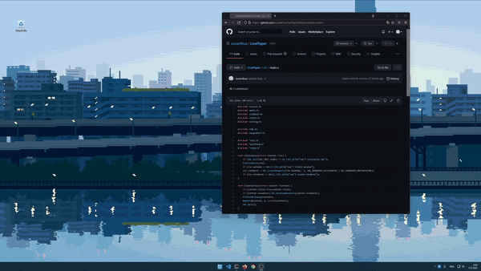

# LivePaper
 

LivePaper is a lightweight application that displays live wallpapers on Windows and Linux. If FFmpeg can play the file, LivePaper can show it as your desktop background.



_Art by [Toyoi Yuuta](https://twitter.com/1041uuu)_

## Build
### Windows
Visual Studio 2019 is recommended. CMake will download all dependencies during configuration when building with VS.

You can do everything from Visual Studio, if desired. Choose "Clone a repostiory..." from the startup menu to clone this repository. VS will configure the project using CMake. Then build as usual.

You can also build in terminal, similarly to the Linux instructions below. You need to install the requirements manually if using e.g. MinGW.

### Linux
Install the requirements
- cmake 3.14
- ffmpeg OR libavcodec-dev libavformat-dev libavutil-dev libswscale-dev libavdevice-dev for Ubuntu and the like
- sdl2

Example for Ubuntu 

```bash
$ sudo apt-get -yq install cmake libsdl2-dev libavcodec-dev libavformat-dev libavutil-dev libswscale-dev libavdevice-dev
```

For Arch
```bash
$ sudo pacman -S cmake sdl2 ffmpeg
```

Then clone the repository, configure and build with CMake.
```bash
$ git clone https://github.com/zuranthus/LivePaper.git && cd LivePaper
$ cmake -B build
$ cmake --build build
$ ./build/live-paper assets/test.gif &
```

## Use
```
Usage: live-paper [-h] [--fit-mode=<mode>] [--cache] <file>
Display a video or an animated file as desktop background.

  -h, --help   = display this help and exit
  --fit-mode=<mode>
               = controls the way the wallpaper is fit on screen
                 possible values: fit, fill, center
  --cache      = decode all frames at once and store them in memory
                 this option is available for short clips only (<=16 frames)
  <file>       = video or animation file to display

Examples: live-paper loop.mp4
          live-paper --fit-mode=fill --cache wallpaper.gif
```

### Linux
Append `&` to run in background. Run `killall live-paper` to stop.

### Windows
LivePaper will run in background from the start, showing an icon in the tray. Right click on the tray icon and select "Quit" to close.


## Notice

Art by [Toyoi Yuuta](https://twitter.com/1041uuu) is used for test wallpapers.
